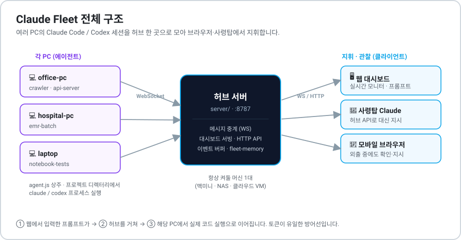
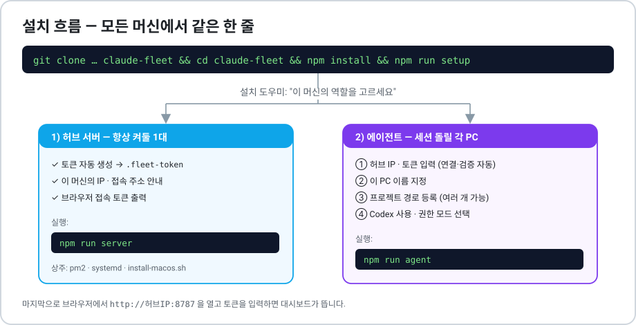
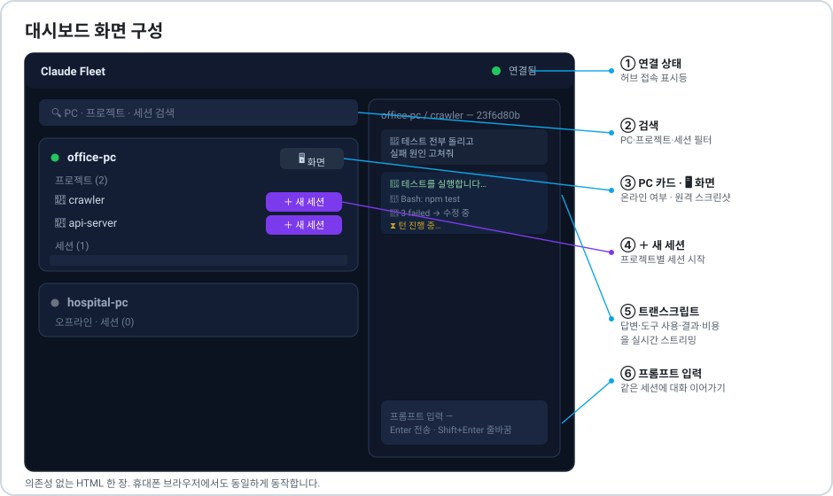
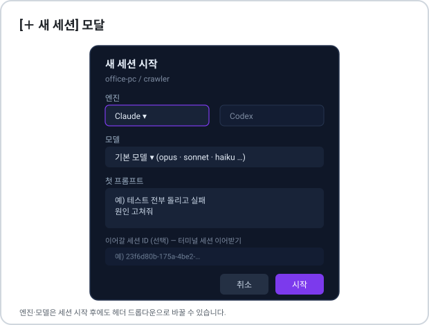
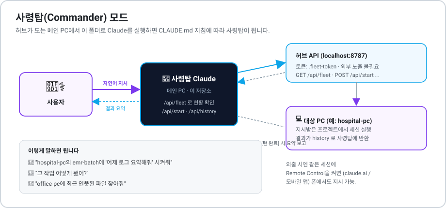
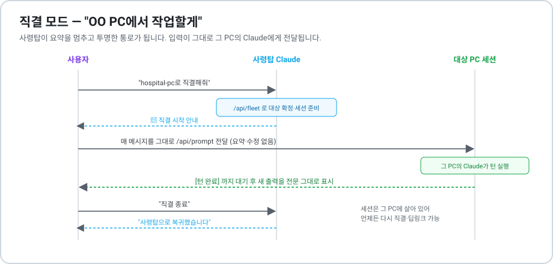
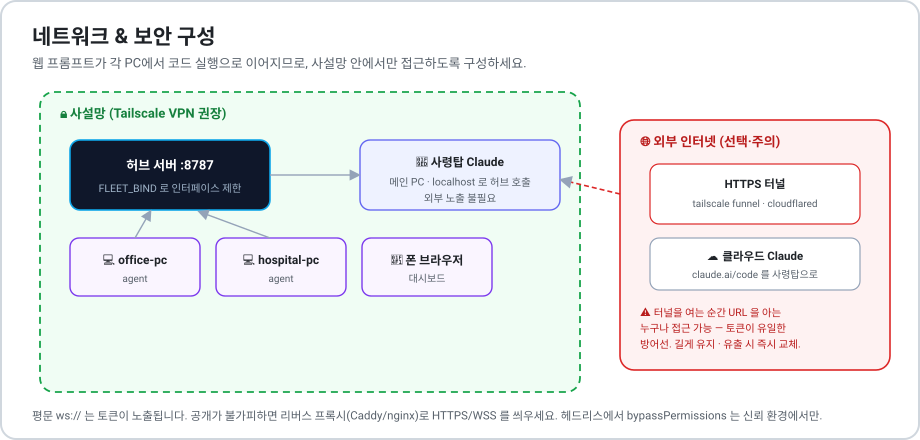

# Claude Fleet 사용 매뉴얼

여러 PC의 Claude Code / Codex 세션을 **웹 브라우저 한 화면에서 실시간으로 지켜보고, 프롬프트를 직접 넣고, 자연어로 지휘**하는 시스템입니다. 이 문서는 처음 설치부터 실전 운영까지 그림과 함께 단계별로 설명합니다.

> 빠른 요약만 필요하면 [README](../README.md)를, 여기서는 화면·흐름을 그림으로 자세히 다룹니다.

## 목차

1. [전체 구조 한눈에 보기](#1-전체-구조-한눈에-보기)
2. [설치하기](#2-설치하기)
3. [대시보드 사용법](#3-대시보드-사용법)
4. [새 세션 시작하기](#4-새-세션-시작하기)
5. [사령탑(Commander)으로 지휘하기](#5-사령탑commander으로-지휘하기)
6. [직결 모드](#6-직결-모드)
7. [원격 화면 보기](#7-원격-화면-보기)
8. [Codex 같이 쓰기](#8-codex-같이-쓰기)
9. [통합 메모리 (fleet-memory)](#9-통합-메모리-fleet-memory)
10. [네트워크 & 보안](#10-네트워크--보안)
11. [자주 겪는 문제 (트러블슈팅)](#11-자주-겪는-문제-트러블슈팅)
12. [설정·API 레퍼런스](#12-설정api-레퍼런스)

---

## 1. 전체 구조 한눈에 보기



세 가지 부품으로 이루어집니다.

| 부품 | 어디서 도나 | 하는 일 |
|---|---|---|
| **허브** (`server/`) | 항상 켜둘 머신 1대 (맥미니·NAS·클라우드 VM) | 대시보드를 서빙하고, 에이전트↔대시보드 메시지를 중계하며, 세션별 최근 이벤트 500개를 버퍼링합니다. |
| **에이전트** (`agent/`) | 세션을 돌릴 각 PC | 대시보드/사령탑 명령을 받아 프로젝트 디렉터리에서 `claude`/`codex` 프로세스를 띄우고 출력을 실시간으로 허브에 흘려보냅니다. |
| **대시보드** (`dashboard/`) | 아무 브라우저 (PC·폰) | PC·프로젝트·세션 목록, 실시간 트랜스크립트, 프롬프트 입력창을 제공하는 HTML 한 장. |

핵심 흐름: **① 웹에서 입력한 프롬프트 → ② 허브 중계 → ③ 해당 PC에서 실제 코드 실행**. 이 구조 때문에 토큰 관리가 곧 보안입니다([10장](#10-네트워크--보안)).

---

## 2. 설치하기

요구사항: **Node.js 18+**, 각 PC에 **Claude Code CLI 설치 및 로그인**.

**모든 머신에서 똑같은 한 줄**을 실행하고, 설치 도우미의 질문에 답하면 됩니다.

```bash
git clone https://github.com/jisu0630/jisu.git claude-fleet
cd claude-fleet && npm install && npm run setup
```

도우미가 "이 머신의 역할"을 묻습니다. 허브냐 에이전트냐에 따라 갈립니다.



### 2-1. 허브가 될 머신 (`1` 선택)

- 토큰이 자동 생성되어 `.fleet-token` 에 저장됩니다.
- 이 머신의 IP와 브라우저 접속 주소·토큰이 화면에 표시됩니다.
- 실행:
  ```bash
  npm run server
  ```
- 터미널을 닫아도 계속 돌게 하려면 상주 등록을 하세요.
  - **macOS**: `bash scripts/install-macos.sh` (로그인 시 자동 시작 + 죽으면 재시작, 해제는 `uninstall` 인자)
  - **Windows**: `powershell -ExecutionPolicy Bypass -File scripts\install-windows.ps1` (작업 스케줄러 등록, 동일 동작)
  - **그 외**: `npx pm2 start "npm run server" --name fleet-hub`

### 2-2. 세션을 돌릴 각 PC (`2` 선택)

도우미가 순서대로 물어봅니다.

1. **허브 주소**(IP 또는 `ws://host:port`)와 **토큰** — 입력하면 연결·토큰 검증을 자동으로 합니다(성공 ✓ / 실패 ✗).
2. **이 PC 이름** — 대시보드에 표시될 이름(생략 시 hostname).
3. **프로젝트 경로** — 이 PC에서 세션을 띄울 폴더들. 여러 개 등록 가능(빈 입력으로 종료).
4. **Codex 사용 여부**와 **권한 모드**(`acceptEdits` 기본 / `bypassPermissions`).

- 실행:
  ```bash
  npm run agent
  ```
- 상주: macOS는 `bash scripts/install-macos.sh`, Windows는 `powershell -ExecutionPolicy Bypass -File scripts\install-windows.ps1`, 그 외는 `npx pm2 start "npm run agent" --name claude-fleet-agent`.

> 다른 네트워크의 PC를 연결하려면 [Tailscale](https://tailscale.com)을 설치하고 허브의 **Tailscale IP**를 주소로 쓰세요.

### 2-3. 데모 모드 (API 소모 없이 시험)

실제 Claude 대신 응답을 흉내내는 목(mock)으로 전체 흐름만 확인할 수 있습니다.

```bash
FLEET_TOKEN=demo-token-demo-token-demo npm run server   # 터미널 1
npm run demo:agent                                       # 터미널 2
# 브라우저에서 http://localhost:8787 접속, 토큰 demo-token-demo-token-demo 입력
```

---

## 3. 대시보드 사용법

브라우저에서 허브 주소(`http://허브호스트:8787`)를 열고, 뜨는 창에 **FLEET_TOKEN**을 입력하면 접속됩니다. 휴대폰 브라우저에서도 동일합니다.



| # | 요소 | 설명 |
|---|---|---|
| ① | **연결 상태** | 허브 접속 표시등. 초록이면 연결됨. |
| ② | **검색창** | PC·프로젝트·세션 이름으로 필터링. |
| ③ | **PC 카드 / 🖥 화면** | 각 PC의 온라인 여부와 프로젝트·세션 목록. `🖥 화면` 으로 원격 스크린샷([7장](#7-원격-화면-보기)). |
| ④ | **＋ 새 세션** | 프로젝트별 새 세션 시작([4장](#4-새-세션-시작하기)). |
| ⑤ | **트랜스크립트** | 어시스턴트 답변·도구 사용·도구 결과·턴 비용을 실시간 스트리밍. |
| ⑥ | **프롬프트 입력** | 선택한 세션에 대화 이어가기. **Enter 전송 · Shift+Enter 줄바꿈**. |

세션 헤더에서는 **엔진/모델 드롭다운**으로 진행 중에도 전환할 수 있고, 세션을 **목록에서 제거**하거나 **중지**할 수 있습니다.

---

## 4. 새 세션 시작하기

PC 카드에서 원하는 프로젝트의 **[＋ 새 세션]** 버튼을 누르면 모달이 뜹니다.



- **엔진** — Claude(기본) 또는 Codex([8장](#8-codex-같이-쓰기)).
- **모델** — 기본 모델 또는 목록에서 선택(opus·sonnet·haiku 등). 시작 후 헤더에서 변경 가능.
- **첫 프롬프트** — 예) `테스트 전부 돌리고 실패 원인 고쳐줘`.
- **이어갈 세션 ID (선택)** — 터미널에서 `/status`로 확인한 세션 ID를 넣으면 그 대화를 대시보드로 이어받습니다.

**[시작]** 을 누르면 세션이 생성되고 오른쪽 패널에 트랜스크립트가 실시간으로 흐릅니다. 이후에는 하단 입력창으로 대화를 이어갑니다.

---

## 5. 사령탑(Commander)으로 지휘하기

대시보드에서 버튼을 누르는 대신, **자연어로 "어느 PC에 무엇을 시켜"** 라고 말해서 지휘할 수 있습니다. 허브가 도는 메인 PC에서 **이 저장소 폴더로 Claude Code를 실행**하면, 저장소의 `CLAUDE.md` 지침에 따라 그 Claude가 **사령탑**이 됩니다.



```bash
cd claude-fleet
claude
```

그런 다음 이렇게 말하면 됩니다.

> 💬 "hospital-pc의 emr-batch에 '어제 로그 요약해줘' 시켜줘"
> 💬 "그 작업 어떻게 됐어?"
> 💬 "office-pc에 최근 인풋된 파일 찾아줘"

사령탑은 허브 API(`localhost:8787`)를 직접 호출해 세션을 시작하고, `[턴 완료]`가 나타나면 결과를 요약해 보고합니다. **터널이나 외부 노출이 전혀 필요 없습니다.**

**밖에서도 사령탑과 대화하려면** 같은 세션에 Remote Control을 켜세요.

```bash
claude --remote-control "fleet-사령탑"     # 또는 세션 안에서 /remote-control
```

그러면 claude.ai / Claude 모바일 앱의 세션 목록에 사령탑이 나타나고, 폰에서 "노트북에 이거 시켜"라고 보내면 메인 PC의 Claude가 받아 처리합니다.

> ⚠ 사령탑은 **허브가 실행 중인 그 머신의 로컬 Claude 세션**에서만 동작합니다. claude.ai/code 같은 클라우드 세션에서 쓰려면 [10-2](#10-2-외부폰에서-접속하기-npm-run-tunnel)의 `npm run tunnel` 로 HTTPS 주소를 먼저 발급하세요.

---

## 6. 직결 모드

특정 PC에 대해 **"직결해줘 / OO에서 작업할게"** 라고 하면, 사령탑이 요약·해석을 멈추고 **그 PC 세션의 프롬프트 창처럼** 투명하게 동작합니다.



1. 사령탑이 `/api/fleet`로 대상 PC·프로젝트를 확정하고 세션을 준비한 뒤 `🔗 직결 시작`을 알립니다.
2. 이후 **사용자의 매 메시지를 그대로**(요약·수정 없이) 그 PC의 Claude에게 전달합니다.
3. 턴이 끝날 때까지 기다렸다가 **새로 생긴 출력을 전문 그대로** 보여줍니다.
4. **"직결 종료"** 라고 하면 사령탑으로 복귀합니다. 세션은 그 PC에 살아 있어 언제든 다시 직결하거나 대시보드 딥링크(`/#s=<PC>/<키>`)로 이어볼 수 있습니다.

---

## 7. 원격 화면 보기

PC 카드의 **[🖥 화면]** 버튼을 누르면 그 PC의 실제 화면 스크린샷을 찍어와 보여줍니다. **"자동 새로고침(5초)"** 를 켜면 준실시간으로 감시할 수 있습니다 — 프롬프트로 작업시키면서 결과 화면을 눈으로 확인하는 용도입니다.

- **macOS**: 처음 사용 시 시스템 설정 → 개인정보 보호 및 보안 → **화면 기록** 에서 터미널(또는 node)을 허용해야 합니다.
- **Windows**: PowerShell로 캡처(별도 설정 불필요). **Linux**: ImageMagick(`import`) 또는 `scrot` 필요.
- 커스텀/테스트: 에이전트 설정 `screenshotCmd`(예: `"cp test/fixture-screen.jpg {out}"`).
- 화면 이미지는 저장되지 않고 대시보드로만 중계됩니다.

> 마우스·키보드까지 원격 제어가 필요하면 **Tailscale + 화면 공유(VNC)** 또는 [RustDesk](https://rustdesk.com)를 쓰세요.

---

## 8. Codex 같이 쓰기

각 PC에 [OpenAI Codex CLI](https://github.com/openai/codex)를 설치·로그인해 두고, 에이전트 설정에 한 줄만 추가하면 됩니다(`npm run setup`에서 `y`로 답해도 됨).

```json
"engines": { "codex": { "bin": "codex", "extraArgs": ["--full-auto"] } }
```

- 대시보드 [새 세션] 모달에 **Claude / Codex 선택**이 생기고, 세션마다 `CLAUDE` / `CODEX` 뱃지가 표시됩니다.
- **한 세션 안에서 엔진을 바꿀 수 있습니다.** 헤더의 엔진 드롭다운을 바꾸면 다음 프롬프트부터 새 엔진이 이어받습니다. 두 CLI의 대화 저장소는 호환되지 않으므로, 에이전트가 지금까지의 대화 기록(최대 8KB)을 인수인계 블록으로 자동 첨부해 맥락을 넘깁니다.
- `extraArgs` 기본값 `--full-auto`는 승인 없이 작업공간 쓰기까지 허용합니다. 더 조이려면 `--sandbox read-only`, 풀려면 `--dangerously-bypass-approvals-and-sandbox` 로 바꾸세요.
- Codex 사용량은 OpenAI 계정에서 과금됩니다.

---

## 9. 통합 메모리 (fleet-memory)

허브가 도는 메인 PC에는 **모든 PC의 세션 대화가 자동으로 영구 기록**됩니다(`fleet-memory/`, git 제외).

```
fleet-memory/
├── INDEX.md                              # 전체 세션 색인 (최신순)
├── transcripts/<PC>/<프로젝트>/<세션>.md  # 읽기 좋은 대화록
├── log/*.jsonl                           # 원본 이벤트 (재시작 시 히스토리 복원)
└── CLAUDE.md                             # 이 폴더 용도 안내 (자동 생성)
```

- "다른 PC에서 무슨 작업 했는지", "예전에 어떻게 해결했는지"는 여기를 검색해 답합니다.
- **과거 세션 이어가기**: `INDEX.md`에서 세션ID를 찾아 `/api/start`에 `"resume":"<세션ID>"`를 넣어 시작하면, 그 PC에 저장된 원본 대화 전체를 이어받은 새 세션이 생깁니다(같은 PC·같은 프로젝트).
- 사령탑이 다른 PC 작업을 알게 하려면 메인 PC 에이전트 `projects`에 fleet-memory를 추가하거나 `claude --add-dir .../fleet-memory`로 엽니다.
- 끄기: `FLEET_MEMORY=off`, 위치 변경: `FLEET_MEMORY_DIR=/원하는/경로`.

---

## 10. 네트워크 & 보안

이 시스템은 **웹에서 입력한 프롬프트가 각 PC에서 코드 실행으로 이어지는** 구조입니다. 토큰이 유출되면 모든 PC에서 임의 명령 실행이 가능하므로 아래를 반드시 지키세요.



### 10-1. 사설망 안에서만 (권장)

- **허브를 공인 인터넷에 그대로 노출하지 마세요.** [Tailscale](https://tailscale.com) 같은 사설 VPN 안에서만 접근하는 구성을 강력히 권장합니다.
- 공용 Wi-Fi에서 노트북으로 허브를 돌릴 때는 바인딩을 제한하세요.
  - `FLEET_BIND=127.0.0.1` — 같은 PC 브라우저만
  - `FLEET_BIND=<Tailscale IP>` — tailnet 기기만
  - 기본값은 모든 인터페이스(같은 망의 폰 접속용). 토큰 실패가 IP당 10분에 20회를 넘으면 그 IP는 자동 차단됩니다.
- `FLEET_TOKEN`은 충분히 길게(`openssl rand -hex 24`) 생성하고 저장소에 커밋하지 마세요(`fleet-agent.config.json`·`.fleet-token`은 `.gitignore` 처리).
- 굳이 공개해야 하면 리버스 프록시(Caddy/nginx)로 **HTTPS/WSS**를 씌우세요 — 평문 `ws://`는 토큰이 그대로 노출됩니다.

### 10-2. 외부·폰에서 접속하기 (`npm run tunnel`)

집 밖, 다른 네트워크, 휴대폰에서도 대시보드에 들어오려면 허브를 HTTPS 로 공개합니다. 허브가 도는 머신에서 한 줄이면 됩니다.

```bash
npm run tunnel                 # cloudflared 있으면 즉석 터널(계정 불필요), 없으면 Tailscale Funnel
npm run tunnel -- --tailscale  # Tailscale Funnel 강제 — 고정 주소, 백그라운드 유지 (권장)
```

실행하면 이런 안내가 출력됩니다.

```
✅ 외부 접속 주소 (Tailscale Funnel · 백그라운드 유지)

   대시보드:  https://macmini.tail1234.ts.net
   HTTP API:  https://macmini.tail1234.ts.net/api/fleet   (Authorization: Bearer <토큰>)

   토큰: .fleet-token 파일의 값 을 입력하세요.
   📱 폰: 위 주소를 브라우저로 열고 토큰 입력 → "홈 화면에 추가" 하면 앱처럼 씁니다.
```

| 방식 | 장점 | 단점 |
|---|---|---|
| **cloudflared 즉석 터널** | 계정 없이 즉시 (`brew install cloudflared` / `winget install Cloudflare.cloudflared`) | 주소가 매번 바뀜, 터미널 닫으면 끊김 |
| **Tailscale Funnel** | 고정 주소, 백그라운드 유지, 사설망과 겸용 | Tailscale 계정 + 관리 콘솔에서 Funnel 허용 필요 |

- 대시보드는 https 아래에서 자동으로 `wss://` 를 쓰므로 추가 설정이 없습니다.
- 터널 도구가 없으면 스크립트가 OS 별 설치 방법을 안내합니다.
- 상시 공개가 부담되면 **Funnel 없이 Tailscale 사설망만** 쓰세요 — 같은 tailnet 의 폰에서는 `http://<Tailscale IP>:8787` 로 터널 없이 들어옵니다.
- 클라우드 Claude(claude.ai/code)를 사령탑으로 쓰려면 새 채팅에서 이렇게 말하면 됩니다:

> 내 fleet 허브는 https://…ts.net 이고 토큰은 XXX야. office-pc의 crawler에 "테스트 돌리고 실패 고쳐줘" 세션 시작하고 결과 알려줘.

> ⚠ **터널이 열려 있는 동안은 주소를 아는 누구나 접속을 시도할 수 있습니다.** 토큰이 유일한 방어선이므로 길게 유지하고(IP당 10분 20회 실패 시 자동 차단), 쓰지 않을 때는 닫으세요(`Ctrl+C` / `tailscale funnel --bg off`). 토큰이 새면 즉시 `.fleet-token`을 바꾸고 허브를 재시작하면 됩니다.

### 10-3. 권한 모드 주의

헤드리스(`--print`) 모드에서는 권한 프롬프트에 답할 수 없습니다. 기본값 `acceptEdits`에서는 파일 편집은 자동 허용되지만 임의 Bash 명령 등은 거부될 수 있습니다. `bypassPermissions`로 바꾸면 모든 것이 허용되므로 **신뢰하는 네트워크 + 신뢰하는 사용자**만 접근 가능한 환경에서만 쓰세요.

---

## 11. 자주 겪는 문제 (트러블슈팅)

| 증상 | 원인 · 해결 |
|---|---|
| 대시보드에 "허브에 연결하면 PC 목록이 표시됩니다" | 에이전트가 안 붙음. 각 PC에서 `npm run agent` 실행 여부, 허브 주소/토큰 확인. |
| 사령탑에서 허브 호출이 "연결 거부" | 허브가 꺼짐. `npm run server`를 백그라운드로 실행하거나 상주 등록(`scripts/install-macos.sh`). |
| 토큰 입력해도 접속 안 됨 | 허브의 `FLEET_TOKEN`과 다름. 값 재확인. 반복 실패 시 IP가 10분간 자동 차단될 수 있음. |
| `🖥 화면`이 검게 나오거나 실패 | macOS는 화면 기록 권한, Linux는 `scrot`/ImageMagick 필요([7장](#7-원격-화면-보기)). |
| 다른 네트워크의 PC가 안 붙음 | Tailscale 설치 후 허브의 Tailscale IP를 주소로 사용. |
| 폰·외부에서 대시보드가 안 열림 | 허브 머신에서 `npm run tunnel` 로 HTTPS 주소 발급([10-2](#10-2-외부폰에서-접속하기-npm-run-tunnel)). 같은 tailnet이면 `http://<Tailscale IP>:8787`. |
| 파일 편집 외 명령이 거부됨 | 권한 모드가 `acceptEdits`. 신뢰 환경이면 `bypassPermissions`로 변경([10-3](#10-3-권한-모드-주의)). |
| 세션이 죽었는데 프롬프트를 또 보냄 | 에이전트가 `--resume <session_id>`로 자동 재개하므로 그대로 이어서 보내면 됩니다. |

---

## 12. 설정·API 레퍼런스

### 에이전트 설정 항목 (`fleet-agent.config.json`)

| 키 | 설명 |
|---|---|
| `hub` | 허브 WebSocket 주소 (`ws://host:8787`, TLS 뒤라면 `wss://…`) |
| `token` | 허브의 `FLEET_TOKEN`과 동일한 값 |
| `pcName` | 대시보드에 표시될 PC 이름 (생략 시 hostname) |
| `projects` | `{name, path}` 배열 — 세션을 띄울 수 있는 프로젝트들 |
| `permissionMode` | `acceptEdits`(기본) / `bypassPermissions` 등 |
| `model` | 세션 모델 지정 (생략 시 기본 모델) |
| `includePartialMessages` | `true`면 토큰 단위 실시간 스트리밍 (트래픽 증가) |
| `claudeBin` | claude 실행 파일 (기본 `claude`, 경로 지정 가능) |
| `engines.codex` | 설정하면 Codex 세션도 시작 가능 |
| `models` | 새 세션·헤더의 모델 드롭다운 목록 |
| `screenshotCmd` | 원격 화면 캡처 커맨드 커스텀 (`{out}` 치환) |

### 허브 HTTP API

모든 호출에 `Authorization: Bearer <FLEET_TOKEN>` 헤더가 필요합니다.

| 메서드 | 경로 | 설명 |
|---|---|---|
| GET | `/api/fleet` | PC/프로젝트/세션 현황 |
| POST | `/api/start` | `{pc, project, prompt, engine?, model?, resume?}` → `{sessionKey}` |
| POST | `/api/prompt` | `{pc, sessionKey, text}` |
| POST | `/api/stop` | `{pc, sessionKey}` |
| GET | `/api/history?pc=..&sessionKey=..` | 대화 내용 (기본 텍스트, `&format=json` 가능) |

예시:

```bash
TOKEN=$(cat .fleet-token); AUTH="Authorization: Bearer $TOKEN"

# 현황
curl -s -H "$AUTH" localhost:8787/api/fleet

# 세션 시작
curl -s -X POST -H "$AUTH" localhost:8787/api/start \
  -d '{"pc":"office-pc","project":"crawler","prompt":"테스트 돌리고 실패 고쳐줘","engine":"claude"}'

# 진행/결과 확인
curl -s -H "$AUTH" "localhost:8787/api/history?pc=office-pc&sessionKey=<키>"
```

### 환경 변수

| 변수 | 설명 |
|---|---|
| `FLEET_TOKEN` | 허브 인증 토큰 (없으면 `.fleet-token` 사용) |
| `PORT` | 허브 포트 (기본 8787) |
| `FLEET_BIND` | 바인딩 인터페이스 (`127.0.0.1` / Tailscale IP 등) |
| `FLEET_MEMORY` | `off`면 통합 메모리 기록 중단 |
| `FLEET_MEMORY_DIR` | 통합 메모리 저장 위치 변경 |

---

## 한계와 다음 단계

- 대시보드에서 권한 프롬프트에 개별 응답하는 기능은 없습니다(필요하면 Agent SDK의 `canUseTool` 콜백 기반으로 확장 가능).
- 직접 운영이 부담스러우면 Claude Code 내장 기능인 `claude remote-control` + claude.ai/code 조합이 같은 문제를 관리형으로 풀어줍니다.
